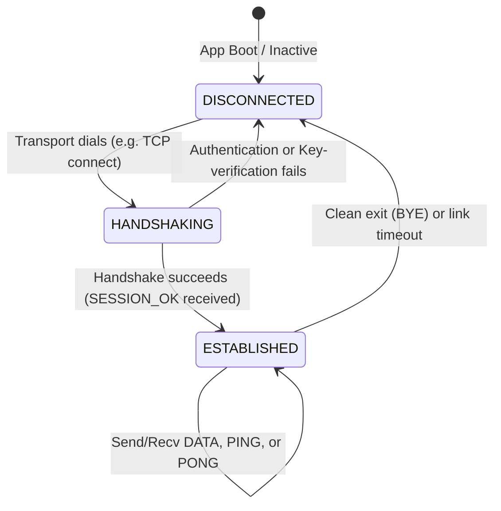

# Protocol Overview: The USMP Layer Cake

USMP is organized as a clean, layered stack of responsibilities. If you have ever felt overwhelmed by massive, monolithic network protocol specifications, don't worry! USMP is designed to be simple, modular, and easy to keep in your head.

Think of each layer as a worker in a postal delivery line. Every worker has one job, and they do it exceptionally well:

```text
┌─────────────────────────────────────────────┐
│              Application Layer              │  ← The letter you wrote (JSON, sensor data)
│         Your data (bytes, structs)          │
├─────────────────────────────────────────────┤
│               Session Layer                 │  ← The tracking number (checks for missing/reordered mail)
│   Sequence numbers · Replay protection      │
├─────────────────────────────────────────────┤
│               Crypto Layer                  │  ← The tamper-proof wax seal (AES-256-GCM + X25519)
│   AES-256-GCM · X25519 · HKDF · HMAC        │
├─────────────────────────────────────────────┤
│               Frame Layer                   │  ← The standard-sized cardboard shipping box (Magic, CRC)
│   Binary encoding · CRC-16 · Magic bytes    │
├─────────────────────────────────────────────┤
│             Transport Layer                 │  ← The truck driving the mail (TCP socket, UART wire)
│        TCP · UART · UDP · BLE               │
└─────────────────────────────────────────────┘
```

## Packet Types: Knowing What's in the Box

To keep overhead low, USMP uses a simple 1-byte packet type identifier. Handshake frames are sent in plaintext (since we don't have a shared key yet!), but once the handshake completes, **every single data frame is locked tight with encryption.**

| Value | Name | Direction | Encrypted? | Purpose |
|:---|:---|:---|:---|:---|
| `0x01` | `PKT_HELLO` | Client → Server | No | "Hi server, here's my device ID and my public key." |
| `0x02` | `PKT_CHALLENGE` | Server → Client | No | "Hi client, here's my public key and a random salt." |
| `0x03` | `PKT_HELLO_ACK` | Client → Server | No | "I've computed our session keys and signed the keys using our PSK." |
| `0x04` | `PKT_SESSION_OK` | Server → Client | No | "Handshake verified! Here is your Session ID. Let's talk secure." |
| `0x05` | `PKT_DATA` | Both | Yes | Your actual payload (or the final frame of a fragmented payload). |
| `0x06` | `PKT_PING` | Both | Yes | Keepalive heartbeats. "Hey, are you still there?" |
| `0x07` | `PKT_PONG` | Both | Yes | Keepalive replies. "Yep, still here!" |
| `0x08` | `PKT_BYE` | Both | Yes | Graceful disconnect. "I'm heading offline now, goodbye." |
| `0x09` | `PKT_DATA_FRAG` | Both | Yes | Initial fragments of a payload larger than 452 bytes. |
| `0xFF` | `PKT_ERROR` | Both | No | Safety valve. "Something went wrong, tearing down the session." |

## Connection Lifecycle

USMP is a stateful protocol. Below is the lifecycle of a connection, from initial dialing to teardown:



* **DISCONNECTED**: The default state. The transport layer is closed, and no session keys exist.
* **HANDSHAKING**: The client has sent a `HELLO` packet. Cryptographic keys are being negotiated and verified.
* **ESTABLISHED**: The handshake succeeded! A secure tunnel is active. Post-handshake packets (DATA, PING, PONG) flow back and forth. If a sequence number is out-of-order or decryption fails, the state machine instantly resets to **DISCONNECTED** as a security precaution.

## Monotonic Sequence Numbers

USMP does not tolerate gaps or loops. To prevent an attacker from capturing encrypted packets and sending them again later to re-trigger a command (a replay attack), USMP uses strict sequence numbers.

* Each direction (TX and RX) maintains its own independent 32-bit counter.
* Both counters start at `0` upon a successful handshake.
* Every sent frame increments the TX counter.
* The receiver expects the incoming packet to match `expected_rx_sequence` exactly. If it does not, the packet is thrown out and the session is terminated.

## Deep Dives

Ready to look closer at the individual layers?

* [Frame Format](frame-format.md) — The exact binary layouts and CRC checks.
* [Handshake Specification](handshake.md) — How we negotiate trust and prevent MITM key swaps.
* [Encryption & Cryptography](encryption.md) — AES-256-GCM configurations, HKDF key derivation, and deterministic nonces.
